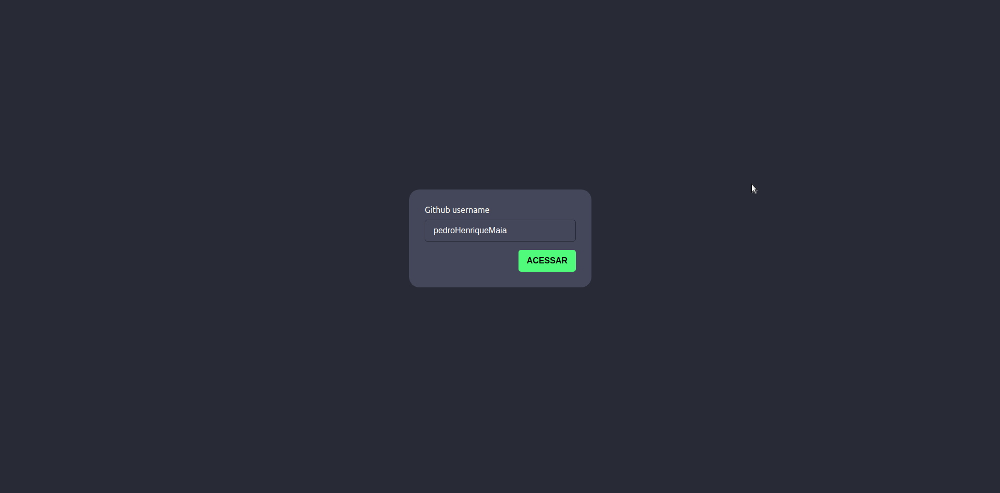
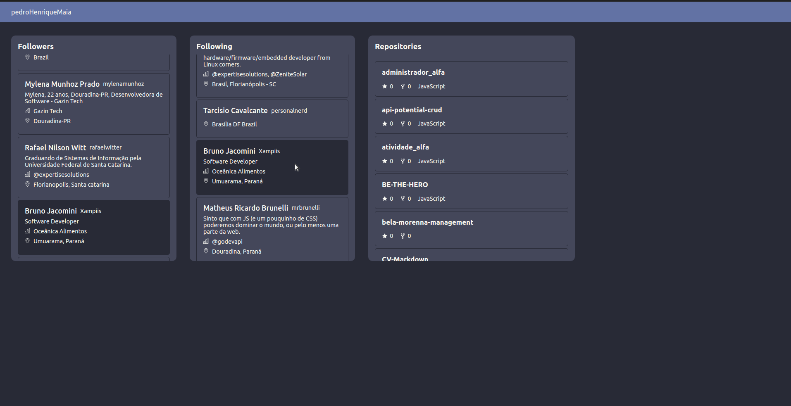
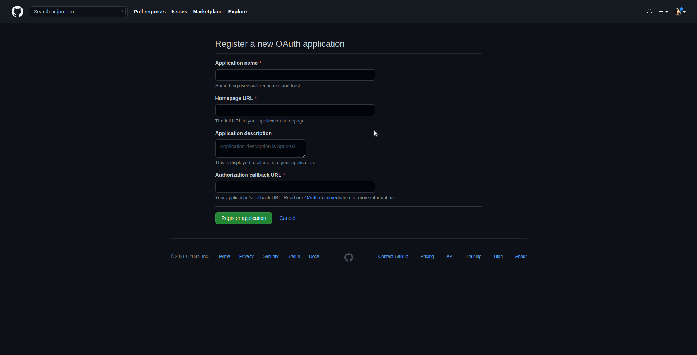

# Consumindo api do guthub
## Rodar Projeto
### Abra seu terminal no vscode e rode os seguintes comandos
```bash
$ npm install
```
```bash
$ npm run start:api
```
```bash
$ npm start
```

### Tela de login
<div style="margim-bottom: 50px;">
    
</div>

### Tela de dashboard
<div style="margim-bottom: 50px;">
    
</div>

## Criando chave permitir a aplicação ter acesso a sua conta
### Entre na home do seu github e siga esse caminho:
`
 setting > Developer settings > OAuth Apps 
`
### clicando em New OAuth App, você entra nessa tela, preencha corretamente.
<div style="margim-bottom: 50px;">
    
</div>

